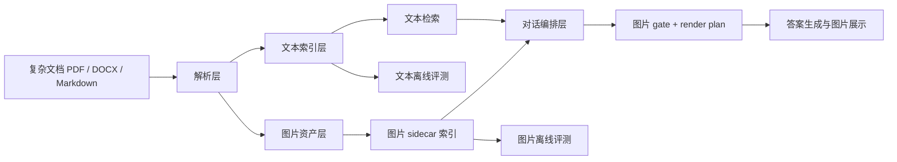
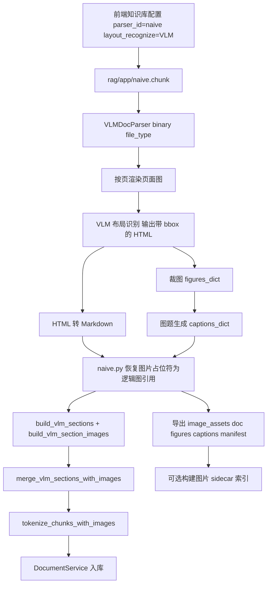
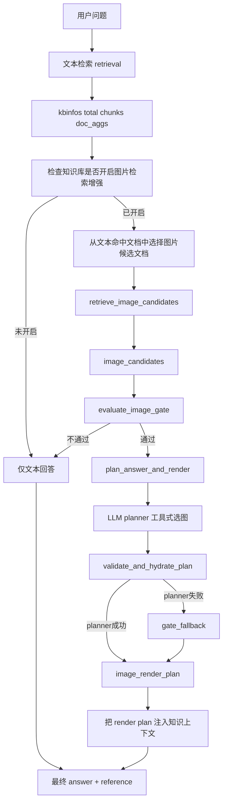

# RAGFlow-Multimodal

> RAGFlow 多模态文档问答公开版

> 这是一个基于 RAGFlow 改造的多模态文档问答系统公开版本，重点支持复杂文档解析、图片资产导出、可选的图文联合检索、图片展示决策与离线评测脚本。

## 项目名称

本项目名称为 **RAGFlow-Multimodal**。

它不是原版 RAGFlow 的官方发布包，而是在 RAGFlow 应用基础上扩展出的公开研究与工程版本，核心目标是把普通文档问答扩展为“复杂文档解析 + 可选图文联合检索 + 图片展示决策”的多模态 RAG 系统。注意：在线图片召回不是默认开启能力，必须在知识库配置中打开图片检索增强开关。

## 相对原版 RAGFlow 的改动

相比原版 RAGFlow，本公开版主要新增和改造了以下模块：

| 改动方向 | 新增/修改内容 | 关键文件 |
| --- | --- | --- |
| VLM 文档解析路径 | 为复杂 PDF / DOCX 增加 VLM 页面理解、Markdown 重建、图片裁剪与图题生成链路 | [`deepdoc/parser/vlm_doc_parser.py`](./deepdoc/parser/vlm_doc_parser.py), [`rag/app/naive.py`](./rag/app/naive.py) |
| 图片资产导出 | 解析后生成 `image_assets/<doc_uid>/figures/*.jpg`、`captions.json`、`manifest.json` | [`rag/app/naive.py`](./rag/app/naive.py), [`rag/image_asset_utils.py`](./rag/image_asset_utils.py) |
| 图文入库衔接 | 在文档入库时保留文本 chunk 与图片 sidecar 元数据的对应关系 | [`api/db/services/document_service.py`](./api/db/services/document_service.py) |
| 图片 sidecar 索引 | 开启图片检索增强后，基于图片向量和图注向量构建 late-fusion 图片检索索引 | [`rag/image_index.py`](./rag/image_index.py) |
| 多模态 embedding 接入 | 封装图片 embedding 调用，供图片索引和召回使用 | [`rag/multimodal_embedding_client.py`](./rag/multimodal_embedding_client.py) |
| 图片候选召回 | 仅在知识库开启 `enable_multimodal_image_retrieval` 后，对话检索才会根据问题和命中文档召回候选图片 | [`api/db/services/dialog_service.py`](./api/db/services/dialog_service.py) |
| 图片展示决策 | 增加 image gate 与 render plan，决定 `none / single / compare / gallery` | [`rag/chat_image_planner.py`](./rag/chat_image_planner.py) |
| 对话引用结构 | 在回答引用中写入 `reference.image_candidates`、`reference.image_gate`、`reference.image_render_plan` | [`api/db/services/dialog_service.py`](./api/db/services/dialog_service.py) |
| 图片静态服务 | 用轻量 Flask 服务暴露 `/image_assets/<path>`，便于前端展示解析图片 | [`image_server.py`](./image_server.py) |
| 评测工具 | 保留文本检索、图片检索、图片展示决策评测脚本，并提供公开示例 Ground Truth | [`evaluate_rag/`](./evaluate_rag) |

## Public Release Notice

这个仓库是整理后的公开发布版本，可以用于学习、复现和二次开发多模态 RAG 链路。

公开版包含：

- 完整多模态功能代码
- VLM 文档解析、图片裁剪、图题整理与图片资产导出
- 可选图片 sidecar 索引、图片候选召回、gate 与 render plan
- 前端配置入口、聊天引用结构与图片展示相关代码
- 通用评测脚本和评测方法说明

公开版不包含：

- 私有文档语料、真实评测集、解析产物、实验结果
- 本地向量索引、图片资产缓存、运行日志
- API key、私钥、本机路径和个人进度文档

因此，clone 后不能在没有配置的情况下直接跑完整链路。你需要先安装依赖、启动基础服务、配置模型 API key，并上传自己的 PDF / DOCX 文档。系统会在本地重新生成 `image_assets/<doc_uid>/` 下的图片、caption、manifest；如果同时打开图片检索增强开关，还会构建并使用可选图片 sidecar 索引。

## Quick Start Summary

如果你只想先把系统跑起来，按这个顺序做：

1. 安装 Python `3.10`、Node.js `>= 18.20.4`、Docker、`uv` 和 `npm`
2. 执行 `uv sync --python 3.10 --all-extras`
3. 执行 `cd web && npm install && cd ..`
4. 配置 VLM、Markdown 模型和图片 embedding 的 API key
5. 执行 `bash ./start_docker_services.sh`
6. 执行 `bash ./start_backend.sh`
7. 执行 `bash ./start_frontend.sh`
8. 打开 `http://localhost:9222`，创建知识库并上传自己的文档

完整说明见下面的“快速开始”和“典型使用方式”。

## 项目简介

本项目面向复杂技术文档问答场景，解决的不是“普通纯文本 RAG 能不能回答问题”，而是下面这一类更接近真实工程使用的问题：

- 文档是 PDF / DOCX，版面复杂，存在多栏、图文混排、公式、表格、图题分离等情况
- 仅靠传统文本抽取，很难稳定建立“正文 - 图题 - 图片”之间的关系
- 用户在提问时，不仅希望得到文本答案，还希望系统在合适的时候展示正确的图片
- 系统不应该“逢问必出图”，而应该判断当前问题到底需不需要图、该出几张图、出哪张图
- 系统不仅要能运行，还要能被正式评测，而不是只靠 demo 观感说明效果

围绕这些目标，本项目设计并实现了一套多模态 RAG 系统，核心思路是：

1. 在文档解析阶段引入 VLM，对页面进行视觉理解，提取结构化 Markdown、图像裁剪和图题描述
2. 在入库阶段保留文本 chunk 与图片 sidecar 元数据，为后续可选图文联动检索提供基础
3. 在问答阶段先做文本检索；如果知识库开启了图片检索增强，再根据问题和命中文档做图片候选召回
4. 在答案生成前增加一个图片 gate + render plan 决策层，判断是否出图、出单图/对比图/图集
5. 为文本检索与图片召回保留通用评测脚本，用户可以基于自己的数据重新构建离线评测闭环

## 目标与核心问题

本项目希望解决四个核心技术问题：

### 1. 复杂文档如何被稳定解析
传统 OCR 或规则式版面分析在复杂技术文档中经常会遇到：

- 阅读顺序错乱
- 图题丢失或与正文分离
- 图片内容无法进入后续检索链路
- 多栏、表格、公式造成 chunk 切分失真

因此本项目不把视觉模型直接用作回答模型，而是把它放在“文档理解前置层”，先把页面解析对。

### 2. 图片信息如何进入 RAG 主流程
很多系统虽然能解析出图片文件，但图片只是静态附件，没有真正成为可检索、可规划、可展示的结构化对象。

本项目的做法是：

- 解析后为每篇文档落盘 `figures/*.jpg`、`captions.json`、`manifest.json`
- 打开图片检索增强后，为图片构建独立 sidecar 索引
- 在线问答时，仅对开启该开关的知识库把图片候选写回 `reference.image_candidates`
- 再由 gate / planner 决定最终是否展示

### 3. 什么情况下应该出图
用户并不是每次都需要图。

本项目显式把图片展示问题拆成三个子问题：

- 有没有可信候选图
- 当前问题是否应该出图
- 如果出图，应该是 `single / compare / gallery / none`

这样做的目的，是把“找图”和“出图”分离，降低误出图和乱出图问题。

### 4. 如何证明系统真的有效
如果没有正式评测，系统很容易停留在“能跑 demo”的状态。

因此本项目额外保留了：

- 文本 retrieval 主评测脚本
- 图片检索评测脚本
- 图片展示决策评测脚本
- 数据集 manifest / README / 报告整理工具

原开发版本使用过成规模的文本与图片评测集；公开仓库不发布这些私有数据。你可以按相同格式放入自己的样本，再运行 `evaluate_rag/` 下的脚本。

## 系统能力概览

| 模块 | 当前能力 | 关键实现 |
| --- | --- | --- |
| 文档解析 | 支持 `DeepDOC / Plain Text / VLM / VisionParser` 等模式 | [`rag/app/naive.py`](./rag/app/naive.py) |
| VLM 页面理解 | 按页输出 `markdown_str + figures_dict + captions_dict` | [`deepdoc/parser/vlm_doc_parser.py`](./deepdoc/parser/vlm_doc_parser.py) |
| 图片资产导出 | 解析后自动写入 `image_assets/<doc>/figures/*.jpg`、`captions.json`、`manifest.json` | [`rag/app/naive.py`](./rag/app/naive.py) |
| 图文统一入库 | 文本 chunk 与图片 sidecar 元数据进入后续链路；图片检索索引需开启增强开关后构建 | [`api/db/services/document_service.py`](./api/db/services/document_service.py) |
| 图片 sidecar 索引 | 开启图片检索增强后，基于图像向量 + 图注向量的 late fusion 检索 | [`rag/image_index.py`](./rag/image_index.py) |
| 图片出图决策 | 支持 `none / single / compare / gallery` 四种模式 | [`rag/chat_image_planner.py`](./rag/chat_image_planner.py) |
| 对话链路集成 | 回写 `reference.image_candidates / image_gate / image_render_plan` | [`api/db/services/dialog_service.py`](./api/db/services/dialog_service.py) |
| 图片服务 | 静态暴露 `image_assets` 下的图片文件 | [`image_server.py`](./image_server.py) |
| 文本评测 | 正式 `text_eval` 数据集、预测与 primary_v2 报告 | [`data/eval_samples/text_eval`](./data/eval_samples/text_eval) |
| 图片评测 | 正式 `image_eval` 数据集、预测、检索与决策报告 | [`data/eval_samples/image_eval`](./data/eval_samples/image_eval) |

## 系统总体架构



从系统设计上看，本项目分成两条互相衔接但职责清晰的主线：

- 离线构建链路：文档解析、图片资产导出、文本入库、可选图片 sidecar 索引、评测集构建
- 在线问答链路：文本检索、可选图片候选召回、图片 gate、render plan、答案生成与前端展示

## 关键创新点

### 1. 将 VLM 放在文档理解层，而不是直接放在回答层
本项目没有把视觉模型简单当作“多模态大模型聊天接口”，而是让它承担页面理解任务：

- 页面渲染
- 版面结构识别
- 图片裁剪
- 图题生成
- Markdown 重建

这样做的好处是，视觉能力可以沉淀为稳定的中间资产，后续检索、问答和评测都能复用，而不是每次回答时重新做一遍视觉理解。

### 2. 图片不再是附件，而是结构化 sidecar 对象
解析后的图片资产不仅落成文件，还会进入一套显式的 sidecar 索引体系：

- 每张图有 `figure_key`
- 每张图有 `caption`
- 每篇文档有 `manifest`
- 可选构建 `image_index_manifest.json` 与 `image_index_vectors.npz`

这使图片可以像文本 chunk 一样被检索、排序、过滤与解释。

### 3. 引入出图决策层
与很多“召回到了图就直接展示”的方案不同，本项目额外设计了 gate 层：

- 先判断问题类型
- 再判断候选分数和角色是否匹配
- 再决定通过与否
- 最终把图片展示模式规划成 `single / compare / gallery / none`

这让系统从“图文混搭回答”提升到“结构化图片展示决策”。

### 4. 构建了双评测闭环
本项目不是只做了一条在线链路，而是把它补成了可复现实验系统：

- 文本、图片检索、图片决策三套脚本可独立评测
- 公开版提供最小 Ground Truth 示例，便于用户按相同格式构造自己的评测集
- 评测输出、manifest 和报告生成逻辑保留在 `evaluate_rag/` 中

## 文档解析与入库链路设计

### 解析模式
`naive.chunk()` 当前对不同文档类型和解析模式采用分类调度策略：

- `PDF`
  - `DeepDOC`
  - `VLM`
  - `Plain Text`
  - 其他图像模型名 -> `VisionParser`
- `DOCX`
  - `VLM`
  - 默认 `Docx()`，并可选 `VisionFigureParser` 做增强

也就是说，`VLM` 不是对原有解析器的小补丁，而是文档解析入口上的一条独立解析路径。

### VLM 解析器的职责
`VLMDocParser` 的真实职责不是“直接产生可入库 chunk”，而是按页输出三类中间结果：

- `markdown_str`
- `figures_dict`
- `captions_dict`

其中：

- `markdown_str` 保存结构化页面文本与图片占位关系
- `figures_dict` 保存图片裁剪结果，key 形如 `p4_2`
- `captions_dict` 保存对应图片的图题或图像说明

### VLM 解析流程



### 图片资产导出
在 `naive.py` 中，VLM 中间结果会被二次整理并导出到：

```text
image_assets/<doc_uid>/
├── figures/
│   ├── p2_1.jpg
│   ├── p3_1.jpg
│   └── ...
├── captions.json
├── manifest.json
├── image_index_manifest.json   # 可选，开启图片检索后构建
└── image_index_vectors.npz     # 可选，开启图片检索后构建
```

其中：

- `captions.json` 保存 `figure_key -> caption`
- `manifest.json` 记录 `run_id / source_file_hash / caption_hash / figure_count / status` 等元数据
- `image_index_*` 文件属于图片检索 sidecar，不是 VLM 解析器直接写出的结果，而是在后续索引阶段异步补建

### chunk 化与真正入库
VLM 解析完成后，系统并不会直接把 Markdown 原文整段入库，而是继续经历：

1. `build_vlm_sections()`
   - 把 Markdown 拆成 `paragraph / abstract / formula / image / list / table`
2. `build_vlm_section_images()`
   - 将 section 内部的逻辑图引用重新映射到真实图片对象
3. `merge_vlm_sections_with_images()`
   - 按 token budget 合并正文 chunk，并把图片 section 隔离成单独 chunk
4. `tokenize_chunks_with_images()`
   - 为 chunk 添加 token、标题路径、图片 sidecar 信息
5. `DocumentService.upload_documents()`
   - 把图片保存到对象存储
   - 设置 `img_id`
   - 对文本做 embedding
   - 最终写入搜索索引

这里有一个很重要的实现边界：

- `VLMDocParser` 负责“页面解析”
- `naive.py` 负责“资产导出 + section/chunk 重组”
- `DocumentService` 才负责“真正入库”

## 在线问答与图片展示链路设计

在线问答阶段，本项目采用“文本主检索 + 可选图片 sidecar 补召回 + 决策层”的设计，而不是让图片链路独立取代文本链路。

这里有一个容易误解的点：图片召回功能不是默认开启的。代码默认把 `parser_config.enable_multimodal_image_retrieval` 设为 `false`；上传/解析后的图片 sidecar 索引构建、在线对话里的 `retrieve_image_candidates()` 调用，都会先检查这个开关。也就是说：

- `layout_recognize = "VLM"` 主要负责 VLM 解析、图片裁剪、caption/manifest 导出
- `enable_multimodal_image_retrieval = true` 才会打开图片检索增强，让系统构建/使用图片 sidecar 索引，并在回答引用中返回 `image_candidates / image_gate / image_render_plan`
- 如果只启用 VLM 解析、不打开图片检索增强，系统仍可走普通文本 RAG 回答，也可能生成 `image_assets/<doc_uid>/` 图片资产，但在线图片召回与出图规划不会执行

### 在线问答主流程



### 文本检索结果对象 `kbinfos`
对话链路中，文本检索首先会生成一个统一的中间对象 `kbinfos`，它至少包含：

- `total`
- `chunks`
- `doc_aggs`

其中：

- `chunks` 是命中的原始检索 chunk 列表
- `doc_aggs` 是按文档聚合后的召回统计
- 之后图片链路会继续往 `kbinfos` 上追加：
  - `image_candidates`
  - `image_gate`
  - `image_render_plan`

最终返回给前端时，这个对象会作为 `reference` 的主体。

### 图片候选召回
图片检索不是对全库图片做无条件全局搜索，也不是默认跟随文本检索自动运行。它只有在知识库开启 `enable_multimodal_image_retrieval` 后才会进入执行路径，并且会先缩小到“文本检索已命中的文档范围”内，再做图片检索。

图片召回的核心设计是：

- 每张图同时保留图像向量和图注向量
- query 先编码成查询向量
- 最终得分采用 late fusion：
  - `0.4 * image_similarity + 0.6 * caption_similarity + query_match_bonus`
- 再根据 caption 对候选进行结构化分类：
  - `semantic_role`
    - `method_overview`
    - `module_structure`
    - `waveform_or_signal`
    - `performance_curve`
    - `comparison_result`
    - `other`
  - `visual_type`
    - `normal_figure`
    - `ui_screenshot`
    - `code_or_terminal`
    - `other`

这意味着图片检索并不是单纯余弦排序，而是“向量分数 + query bonus + 语义多样性去重”的混合策略。

## 图片 gate 与 render plan 设计

本项目把“该不该出图”单独做成了一层决策逻辑，而不是把候选图直接交给回答模型自由发挥。

### gate 的作用
`evaluate_image_gate()` 负责：

1. 根据 query 推断问题属于哪一类
2. 对候选图分数做二次调整
3. 根据规则判断是否通过
4. 给出 `mode_hint`
5. 输出筛过的候选集合 `filtered_candidates`

### query type
当前 gate 内部会把问题大致分为：

- `specific_figure`
- `compare`
- `method_overview`
- `performance_overview`
- `broad_visual`
- `text_only`

这是在线启发式分类，不等于离线评测集里的标签，但二者有明显映射关系。

### render mode
最终渲染模式只有四种：

- `none`
- `single`
- `compare`
- `gallery`

对应前端展示布局：

- `focus`
- `side_by_side`
- `grid`

### planner 的作用
当 gate 通过后，系统会启动一个工具式 planner：

- 它只能从 allowlist 候选里选图
- 主要工具为：
  - `search_image_candidates`
  - `get_figure_metadata`
- 最终输出 JSON 形式的 render plan
- render plan 会再次经过合法性校验，确保：
  - 候选来自 allowlist
  - `single/compare/gallery` 张数合法
  - 最终能补全 `image_url`、caption 和展示元信息

如果 planner 失败，代码不会直接中断，而是会走 `gate_fallback`，由 gate 结果直接生成一个最小可用的 render plan。

## 前端与展示层设计

前端当前已经接入以下能力：

- 知识库配置页可选择 `layout_recognize`
- 可打开 `enable_multimodal_image_retrieval`，这是在线图片召回和出图规划的必要开关
- 聊天消息中可以读取：
  - `reference.image_candidates`
  - `reference.image_gate`
  - `reference.image_render_plan`

图片静态访问由一个轻量 Flask 服务提供：

- `GET /`
  - 返回服务状态与图片输出目录
- `GET /image_assets/<path>`
  - 直接映射到 `image_assets/` 目录中的图片文件

这让回答阶段最终生成的 `image_url` 可以稳定落到一个明确的 HTTP 路径，而不是临时 base64 或不可追溯的文件句柄。

## 评测体系

公开分支保留评测脚本与评测方法说明，但不随仓库发布私有 Ground Truth、解析产物或实验报告。

你可以用自己的数据重新生成同类评测集与报告：

- 文本检索与生成评测：[`evaluate_rag/rag_eval_full.py`](./evaluate_rag/rag_eval_full.py)
- 图片检索评测：[`evaluate_rag/image_search_eval.py`](./evaluate_rag/image_search_eval.py)
- 图片出图决策评测：[`evaluate_rag/image_search_decision_eval.py`](./evaluate_rag/image_search_decision_eval.py)
- 图片评测集构建：[`evaluate_rag/build_image_search_full_groundtruth.py`](./evaluate_rag/build_image_search_full_groundtruth.py)
- 图片评测集校验：[`evaluate_rag/validate_image_search_groundtruth.py`](./evaluate_rag/validate_image_search_groundtruth.py)

本地生成的数据建议放在 `data/eval_samples/` 或其他私有目录中；该目录已被 `.gitignore` 忽略。

### 文本评测口径

文本侧使用 evidence-level calibrated retrieval。核心命中原因包括：

- `strict`
- `same_doc_context`
- `answer_support`

主口径 `primary_v2` 的 headline 指标为：

- `primary_summary = mean(recall@3, hitrate@3, recall@5, hitrate@5)`

辅助结构指标为：

- `structural_robustness = mean(gt_doc_coverage@3, gt_doc_coverage@5, multi_hop_multi_doc_rate@5, type_balance.score)`

### 图片评测口径

图片评测分成两部分：

- 图片检索评测：`image_hit@k`、`image_recall@k`、`image_mrr`、`doc_hit@k`、`wrong_doc_rate`
- 图片决策评测：`show_precision`、`show_recall`、`false_show_rate`、`missed_show_rate`

公开仓库不包含论文数据集、解析截图、向量索引或历史实验结果。用户 clone 后可以上传自己的文档，系统会重新生成 `image_assets/<doc_uid>/` 下的图片、caption、manifest 和可选图片索引。

## 快速开始

下面是面向公开仓库的源码启动流程。它会启动 RAGFlow 后端、前端、基础依赖服务和本地图片服务，但完整多模态效果仍依赖你的模型配置与上传文档。

### 1. 环境准备

建议至少满足：

- Python `3.10`
- Node.js `>= 18.20.4`
- Docker / Docker Desktop
- `uv`
- `npm`
- 16 GB 以上内存

### 2. 安装依赖

```bash
git clone https://github.com/<your-user>/RAGFlow-Multimodal.git
cd RAGFlow-Multimodal

uv sync --python 3.10 --all-extras
cd web && npm install && cd ..
```

如果你在 macOS 上本地编译依赖，可以先加载：

```bash
source ./load_dev_env.sh
```

### 3. 配置关键环境变量

至少需要配置下面几类 key。变量名是本公开版新增链路使用的推荐名称；如果你接入的是 RAGFlow 原生模型配置，也可以在 UI 或 `conf/service_conf.yaml` 中配置对应模型。

```bash
export RAGFLOW_VLM_API_KEY=<your_vlm_key>
export RAGFLOW_MD_API_KEY=<your_markdown_model_key>
export RAGFLOW_IMAGE_EMBEDDING_API_KEY=<your_image_embedding_key>
export SERVER_IP=http://127.0.0.1:8000
```

- `RAGFLOW_VLM_API_KEY`：用于 VLM 页面理解和图片/图题提取
- `RAGFLOW_MD_API_KEY`：用于 Markdown 重建或相关文本生成步骤
- `RAGFLOW_IMAGE_EMBEDDING_API_KEY`：用于图片 embedding 和可选图片 sidecar 索引
- `SERVER_IP`：聊天回答中生成图片 URL 时使用，默认指向本地 `image_server.py`

如果你使用同一厂商的 OpenAI-compatible 服务，Markdown 模型和图片 embedding 可以复用同一套 key。不同厂商或自建模型需要按实际 SDK / endpoint 修改相应配置。

### 4. 启动基础依赖服务

```bash
bash ./start_docker_services.sh
```

默认会启动：

- MySQL：`localhost:5455`
- Elasticsearch：`localhost:1200`
- MinIO：`localhost:9000`
- Redis：`localhost:6380`

### 5. 启动后端

```bash
bash ./start_backend.sh
```

后端脚本会拉起：

- `api/ragflow_server.py`
- `rag/svr/task_executor.py`
- `image_server.py`

### 6. 启动前端

```bash
bash ./start_frontend.sh
```

启动完成后访问：

- 前端：`http://localhost:9222`
- 后端：`http://127.0.0.1:9380`
- 图片服务：`http://127.0.0.1:8000/`

## 典型使用方式

### 路径 A：先验证普通文档问答

1. 启动前端和后端
2. 创建知识库
3. 上传一份普通 PDF / DOCX / Markdown
4. 等待解析完成
5. 创建聊天应用或会话，提问文档内容

这条路径主要验证基础 RAGFlow 链路是否可用，不要求图片召回一定启用。

### 路径 B：完整验证多模态链路

如果你想复现图文联合检索与图片展示决策，推荐按下面步骤。特别注意：只设置 VLM 解析还不够，图片召回需要额外打开图片检索增强开关。

1. 创建知识库
2. 选择 `naive` 解析方式
3. 设置：
   - `parser_config.layout_recognize = "VLM"`
4. 如果需要在线图片召回，再额外设置：
   - `parser_config.enable_multimodal_image_retrieval = true`
5. 导入复杂 PDF / DOCX 文档
6. 等待解析完成，检查 `image_assets/<doc_uid>/` 下是否生成图片与 caption 资产
7. 在对话中提问图相关问题，观察：
   - 文本答案
   - `reference.image_candidates`
   - `reference.image_gate`
   - `reference.image_render_plan`

常见适合测试的问题包括：

- “图 1 展示了什么？”
- “请结合文档中的流程图解释整体方法。”
- “比较 Figure 2 和 Figure 3 的差异。”
- “这篇文档的核心结论是什么？”

最后一个问题通常不需要出图，可以用来观察 gate 是否会避免无关图片展示。

如果只想验证局部模块，可以看：

- [`test_vlm_parser.py`](./test_vlm_parser.py)
- [`test_vlm_chain.py`](./test_vlm_chain.py)
- [`test_image_recall.py`](./test_image_recall.py)

## 仓库结构

### 核心后端模块

- [`deepdoc/parser/vlm_doc_parser.py`](./deepdoc/parser/vlm_doc_parser.py)
  - VLM 文档解析器
- [`rag/app/naive.py`](./rag/app/naive.py)
  - 解析主入口、资产导出、VLM section/chunk 重组
- [`api/db/services/document_service.py`](./api/db/services/document_service.py)
  - 文档上传、图片对象保存、文本向量化与真正入库
- [`rag/image_index.py`](./rag/image_index.py)
  - 开启图片检索增强后的图片 sidecar 索引与候选召回
- [`rag/chat_image_planner.py`](./rag/chat_image_planner.py)
  - 图片 gate 与 render plan
- [`api/db/services/dialog_service.py`](./api/db/services/dialog_service.py)
  - 对话编排、文本检索、图片候选回写与答案后处理
- [`image_server.py`](./image_server.py)
  - 本地图片服务

### 前端与配置

- [`web/`](./web)
  - 知识库配置、聊天展示与前端页面
- [`conf/service_conf.yaml`](./conf/service_conf.yaml)
  - 本地开发服务配置
- [`start_docker_services.sh`](./start_docker_services.sh)
- [`start_backend.sh`](./start_backend.sh)
- [`start_frontend.sh`](./start_frontend.sh)

### 评测与数据

- [`evaluate_rag/`](./evaluate_rag)
  - 评测脚本与构建工具。私有 Ground Truth 与实验报告不随公开分支发布。

## 当前项目边界

本项目当前已经完成了“解析 -> 入库 -> 检索 -> 出图 -> 评测”的完整闭环，但仍有一些明确边界：

- 图片链路目前更像“回答阶段的结构化 grounding + 展示规划”，不是独立通用图片搜索引擎
- 对宽泛视觉问题，主图 Top1 排序可能受文档结构和图题质量影响
- 一部分问题可能已经召回正确图片，但 gate 会因为置信度不足而选择不展示
- 文本侧评测脚本偏向 retrieval 质量分析；generation 评测需要用户准备自己的预测结果与参考答案
- 公开仓库不提供私有评测数据，因此指标需要在你的数据集上重新计算

## 更多文档

- 想快速了解部署：
  - [`docs/quickstart.mdx`](./docs/quickstart.mdx)
- 想源码运行：
  - [`docs/develop/launch_ragflow_from_source.md`](./docs/develop/launch_ragflow_from_source.md)
- 想看配置说明：
  - [`docs/configurations.md`](./docs/configurations.md)
- 想看健康检查：
  - [`docs/guides/run_health_check.md`](./docs/guides/run_health_check.md)
- 想看 API：
  - [`docs/references/http_api_reference.md`](./docs/references/http_api_reference.md)
  - [`docs/references/python_api_reference.md`](./docs/references/python_api_reference.md)

## License

本项目沿用仓库根目录中的 [LICENSE](./LICENSE)。
